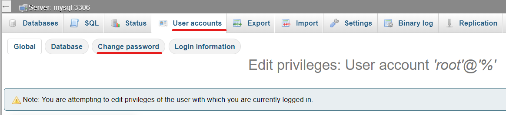

[](https://github.com/XAMPPRocky/tokei)
[](https://www.codacy.com/gh/htl-anichstrasse/sokka/dashboard?utm_source=github.com&amp;utm_medium=referral&amp;utm_content=htl-anichstrasse/sokka&amp;utm_campaign=Badge_Grade)
[](https://github.com/htl-anichstrasse/sokka/blob/master/LICENSE)

# Sokka

<br/>
<p align="center">
  <a href="https://sokka.me/">
    
  </a>

  <h3 align="center">Sokka</h3>

  <p align="center">
    A modern ordering and payment system for canteens and restaurants.
    <br/>
    <a href="https://github.com/htl-anichstrasse/sokka/releases">Releases</a>
    ·
    <a href="https://github.com/htl-anichstrasse/sokka/blob/master/docs/thesis.pdf">Thesis</a>
  </p>
</p>

## About the project
Sokka is a diploma project created by students Joshua Winkler and Nicolaus Rossi of the higher technical college HTL Innsbruck Anichstraße in the department of industrial engineering. The project is supervised by software engineering professor Sabo Rubner.

## Installation

### Setup

Clone the repository.
```
git clone https://github.com/htl-anichstrasse/sokka.git
```

Change the Docker container names, `VIRTUAL_HOST`, `NGINX_HOST` & `LETSENCRYPT_HOST` settings for all containers to use the domain name you want Sokka to use. Once you're ready, simply run the start script with the build flag. It is currently not possible to change the Sokka brand via configuration. You may however fork this repository and replace Sokka logos with your corporate logo.

```
./start.sh build
```

Please note that you might have to adjust file permissions first.

```
chmod +x start.sh
chmod +x build.sh
chmod +x stop.sh
```

### Configuration

Make sure to change the MySQL default root password after setup. This can be done by logging in to the phpMyAdmin page (see `NGINX_HOST` environment variable for the PMA Docker container), clicking on `User accounts`, then `Edit privileges` for the `root` user account and then on `Change password`.



After setting a new MySQL password, create needed Docker Secrets. Docker loads the secrets from `./secrets`, so simply create a folder called 'secrets' in the root folder of the project and create text files referenced in `docker-compose.yml` with the corresponding contents.

Besides MySQL login data, you will also need to create Docker Secrets for a Gmail login used by the verification service. For that, you will need to create an app password by clicking [here](https://myaccount.google.com/u/1/apppasswords) or by following [this guide](https://support.google.com/accounts/answer/185833). After you have obtained your app password, simply set the password and the email corresponding to the password as a Docker Secret.

## Contact

If you have any questions about this project, please feel free to contact us.

Nicolaus Rossi - nico@sokka.me<br>
Joshua Winkler - josh@sokka.me<br>
HTL Anichstraße - htlinn@tsn.at

<a href="https://htlanichstrasse.tirol" target="_blank"></a>
