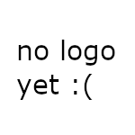

# Sokka

 

  

  <h3 align="center">Sokka</h3>

  

    A highly functional, configurable and modular mobile ordering system for cantinas and restaurants.
     
    <a href="https://github.com/htl-anichstrasse/sokka/releases">Releases</a>
    ·
    <a href="https://github.com/htl-anichstrasse/sokka/issues">Report Bug</a>
    ·
    <a href="https://github.com/htl-anichstrasse/sokka/issues">Request Feature</a>
    ·
    <a href="https://sokka.me/not-there-yet">Thesis</a>
  

## About the project
Sokka is a diploma project created by students Joshua Winkler and Nicolaus Rossi of the higher technical college HTL Anichstraße in Innsbruck, Austria. It was created for use by the cantina of Innsbruck's tourism schools and supervised by software engineering professor Sabo Rubner.

## Contact

If you have any questions about this project, please feel free to contact us.

Nicolaus Rossi - nirossi@tsn.at 
Joshua Winkler - jos.winkler@tsn.at 
HTL Anichstraße - htlinn@tsn.at